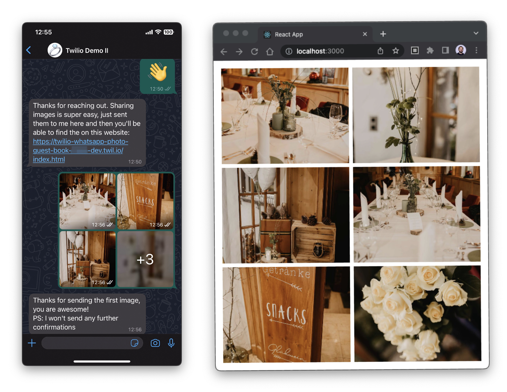

# Photo Sharing with WhatsApp

Birthday parties, weddings, anniversaries, and other social events are always great gatherings where we create memories that last a lifetime. At these events, everyone is a photographer who tries to capture the best moments on their phone and possibly share them with the host afterward. But other guests usually never see the photos because they are not shared with the entire party. A common solution to this is using photo-sharing apps, on which you can upload the photos you took.

The problem with these apps is that they first need to be installed by everyone and often have a complicated setup process. And in the end, only a tiny fraction of the guests share their memories.
To combat that, I decided to build on top of a messenger that almost everyone already uses: WhatsApp. Hence, WhatsApp users already know how to send pictures and receive messages with the app.



## Prerequisites

- [Node.js](https://nodejs.org/en/) installed.
- An upgraded [Twilio account](https://www.twilio.com/try-twilio).
- Install the [Twilio CLI](https://www.twilio.com/docs/twilio-cli/getting-started/install).
- [Buy a number](https://support.twilio.com/hc/en-us/articles/223135247-How-to-Search-for-and-Buy-a-Twilio-Phone-Number-from-Console) you want to use and [enable it for WhatsApp](https://www.twilio.com/docs/whatsapp/tutorial/connect-number-business-profile).

## Setup

- Create a [Sync Service](https://www.twilio.com/docs/sync) that contains a [Document Resource](https://www.twilio.com/docs/sync/api/document-resource)
- _Optional_ Create a [Messaging Service](https://support.twilio.com/hc/en-us/articles/223181308-Getting-started-with-Messaging-Services)
- Copy `.env_example` to `.env` and replace the listed environment variables
- Deploy the project

  ```bash
  npm install
  npm run full-deploy
  ```

- Give out QR codes so that users can send messages to the registered number

## Folder structure

### Functions

There are three Functions used. The first one, `incoming.js`, handles incoming messages and returns TwiML responses to the senders. The second one, `images.js`, returns the media URLs found in the logs to the frontend (incl some metadata). And the last one, `likes.js`, uses a Document Resource to store the like count per image.

### Frontend

The frontend code is present inside the `frontend` folder.
The entire setup is hosted on Twilio Serverless, and the frontend is served as static pages.
While the frontend is a react app, to update the frontend.

Test the react app locally

1. Deploy the backend

```bash
npm run build-deploy
```

2. Adapt the `proxy` field in the `package.json` of the frontend app.

3. Run it locally

```bash
npm run start
```

## Download all files

To download all received media files, you need to run the following script and wait for the downloads to complete.

```
npm run download
```

## Reset the gallery

Run the following script the clear the gallery and reset the application.

```
npm run clearGallery
```
